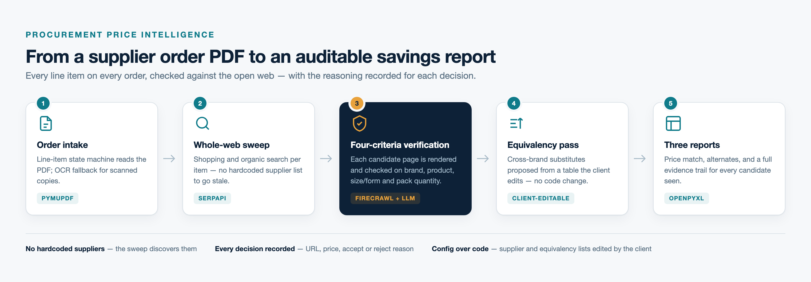
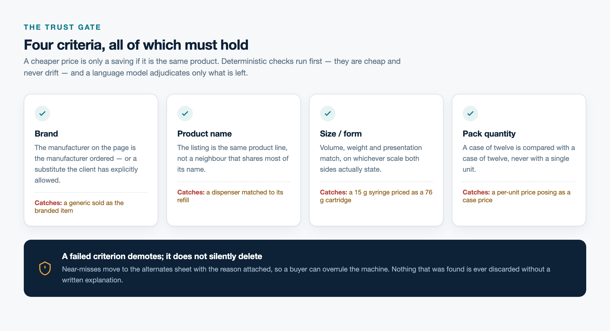
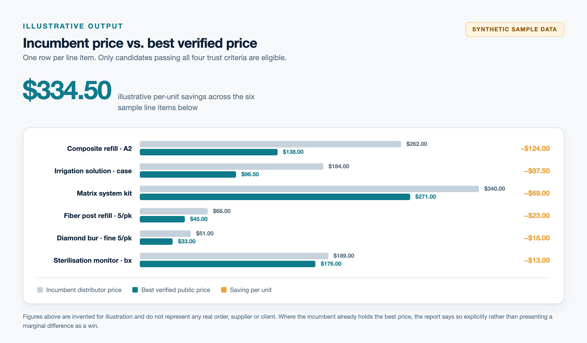
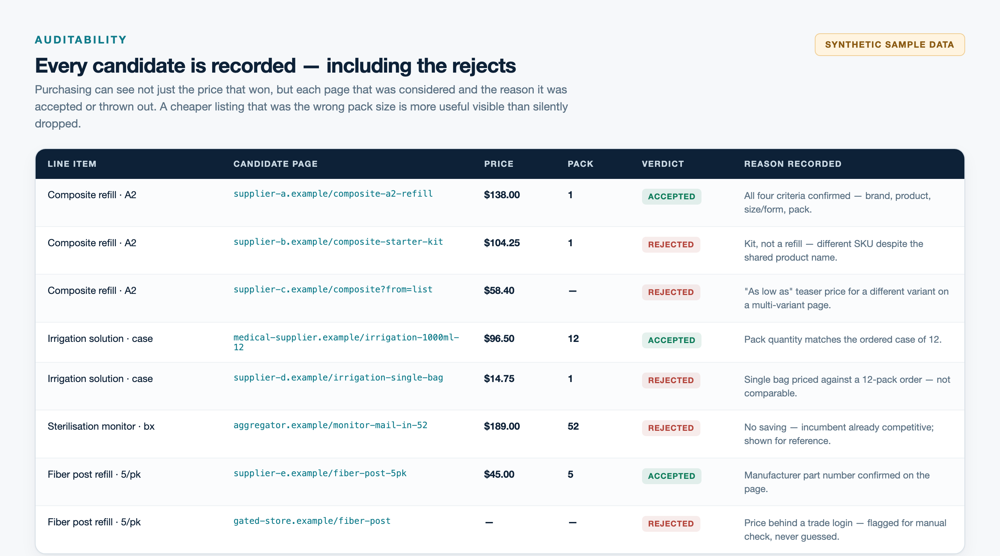

# Dental Price Intelligence — Case Study

**Automated procurement price-intelligence for a dental practice — every weekly order, checked against the whole web.**

> **Note:** Showcase repository. Production source and all client data are private. This is a walkthrough of the work, the decisions, and the results.

  

---

## The brief

A US dental practice places a supply order most weeks — dozens of line items, each a specific brand, shade, size and pack quantity. The same products are sold across the open web, often for materially less.

Checking that by hand is not realistic. Every line item means a search, several product pages, and a judgement about whether the cheaper listing is genuinely the same thing — the same shade, the same pack of twelve, the same 76-gram cartridge rather than the 15-gram syringe. Multiply by dozens of items, every week, and the honest outcome is that nobody does it. Savings get left on the table by default.

Purchasing also can't act on a number with no provenance. "This is cheaper somewhere" is not a decision; "this is $87.50 cheaper at this URL, same pack of twelve, verified on the page" is.

## The idea

A pipeline that does the tedious part exhaustively and shows its working:

1. **Read the order PDF** and recover the line items exactly as ordered.
2. **Sweep the open web** per item — no hardcoded supplier list, because any such list is wrong within a quarter.
3. **Verify each candidate** by actually rendering the page and testing it against four criteria.
4. **Propose equivalents** where no exact match exists, from a table the client controls.
5. **Emit three reports** — what to switch, what to consider, and the full evidence for both.

The design constraint throughout: **a cheaper price is only a saving if it is the same product.** A tool that over-reports savings is worse than no tool, because it burns the buyer's trust on the first bad row.

---

## How it was built

I built this with **Claude Code** as a pair-engineer. It was a genuine accelerator on the plumbing — the FastAPI surface, the report writer, the retry and rate-pacing scaffolding.

The parts that matter were deliberate engineering decisions: what counts as a match, what gets rejected and why, what the buyer sees when the system is unsure. Those came from reading real failure cases and reasoning about them — a 15-gram syringe matched to a 76-gram cartridge, an "As low as" teaser price scraped as if it were the product's price, a dispenser matched to its own refill.

> AI to move fast. Judgement about what "correct" means. That's the work.

Most of the engineering below exists because a specific wrong answer showed up in a report and had to be understood before it could be fixed.

---

## Selected engineering

### Order intake: a strict line-item grammar, not a text dump

Order PDFs are laid out for humans. A naive text extraction gives you addresses, phone numbers and totals mixed in with products.

Intake uses a strict line-item pattern — quantity, product code, description, unit of measure, unit price, extended price — and accepts a row only if it satisfies the whole shape. Addresses and footers cannot pass it. The unit price is then cross-checked against quantity × unit ≈ extended, so a column misread fails loudly instead of quietly producing a wrong baseline. Scanned orders fall back to OCR.

### Whole-web sweep, then verification on the rendered page

Discovery runs shopping and organic search per item, with brand-specific and brand-stripped queries — house-brand items are sold by nobody else under that name, so the generic query is what finds a comparable product at all.

Candidates are then **actually loaded**, with JavaScript rendered, because a large share of supplier storefronts show no price to a plain fetch. Login-walled prices are detected and flagged for manual checking rather than guessed at. Multi-seller aggregator pages get a dedicated parser: the lowest *available* seller, not the lowest number on the page.

### The four-criteria trust gate

  

Deterministic checks run first — price sanity, volume and mass normalisation, pack tolerance. They are cheap, they never drift, and they catch the majority of bad matches. A language model then adjudicates only what survives, against the four criteria above.

The ordering matters. Deterministic rules are reproducible; model judgement is not. Anything that can be decided arithmetically is decided arithmetically, and the model is reserved for genuine ambiguity.

### Client-editable equivalency, driving the alternates report

Where no exact match exists — house brands, discontinued lines — the system proposes a substitute from an equivalency table **the client edits themselves**, through an admin screen. Supplier lists and exclusions work the same way.

This was a deliberate call: the domain knowledge about which products are genuinely interchangeable belongs to the practice, not to me, and it changes faster than a deployment cycle.

### Running usefully on free-tier AI quotas

Cost mattered, so the system is built to work within free-tier limits: a request pacer, exponential backoff, multi-key rotation with immediate failover when a key is spent, and a cheap model for the bulk of pages with a stronger one reserved for candidates the cheap one was unsure about.

Two caches — discovered URLs and scraped pages — mean re-running an order costs a fraction of the first pass.

---

## Results

  

**Savings surfaced per line item**, with the incumbent price and the verified alternative side by side. Where the incumbent already holds the best price, the report **says so explicitly** rather than dressing a 0.7% difference up as a win.

**Every candidate is recorded — including the rejects.**

  

A buyer can see each page considered and why it was accepted or thrown out. A cheaper listing rejected for being the wrong pack size is more useful visible than silently dropped — sometimes the buyer knows something the system doesn't, and can overrule it.

**Configuration without code.** Supplier sources, exclusions and equivalency rules are edited by the client through the admin UI. Adding a supplier is not a deployment.

All figures in the visuals above are synthetic and illustrative. They do not represent any real order, supplier, price or client.

---

## Stack

| Layer | Tech |
|---|---|
| API | FastAPI · Python 3.12 · Uvicorn |
| Order intake | PyMuPDF · regex line-item grammar · OCR fallback |
| Discovery | SerpAPI (shopping + organic, multi-query per item) |
| Verification | Firecrawl (JS-rendered pages, login-wall detection) |
| Reasoning | Groq · Llama-3.3-70B — batched, paced, multi-key |
| Reports | openpyxl — price match · alternates · evidence trail |
| Persistence | SQLite — discovery cache, scrape cache, learned product facts |
| Frontend | React · Vite · TypeScript · live SSE progress |
| Deploy | Docker · Render |

---

## Let's work together

I build practical AI-accelerated systems — the kind that have to be right, not just impressive.

📫 [X / @malaikaafridi9](https://x.com/malaikaafridi9) · **DMs open.**

Production source code and all client data are private. Visuals in this repository were generated for illustration and contain no real order, pricing or supplier information.
